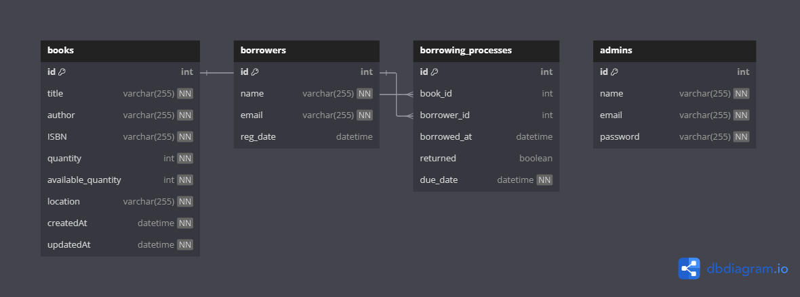

# 📚 Library Management System 📚

Bosta Library Management System is a Node.js-based application designed to help manage books and borrowers in a library setting. This system allows users to perform CRUD operations on books and borrowers, manage the borrowing process, track overdue books, and generate analytical reports. The system is built using a RESTful API architecture and utilizes a relational database system for data storage.

## Key Features 🔑

- User-friendly interface for library management 💻
- Admin panel for managing books, borrowers, and borrowing processes 🚀
- Search and listing system for books and borrowers 🔎
- Borrowing process management with due date tracking 📅
- Updates on book availability and borrowing status 🕒

Feel free to customize the content further based on your project specifics and preferences.

## System Design 🛠️

> The schema diagram provides a visual representation of the relationships between the various entities, such as books, borrowers, and borrowing processes, in the system. It provide a comprehensive overview of the system architecture and data flow, ensuring a well-designed and efficient library management system.

Schema

### API Endpoints 🔌

API Documentation is found at : localhost:3000/api-docs

Books

-  List all books
- Get a specific book
- Add a new book
- Update a book
- Delete a book

Borrowers

-  List all borrowers
- Get a specific borrower
- Add a new borrower
- Update a borrower
- Delete a borrower

Borrowing Process

- List all borrowing processes
- Checkout a book
- Retrieve a list of borrowing processes for a specific user
- Retrieve a list of overdue borrowing processes

Statstical Methods

* Retrieve a report of borrowing processes within a specific period and export data in CSV format
* Export a report of overdue borrows from the last month in CSV format
* Export a report of borrowing processes from the last month in CSV format

### ASSUMPTIONS:

- Available_quantity shouldn't be altered (derived only from processes of borrowing)
- Borrowers are lent books through librarians (admins) who register their borrowing process on the system - borrowers don't have access to our system
- all workers are have accounts on our system ( have entry in table admins)
- No feature can be accessed unless user is logged in

## Table of contents 🏷

| File Name                                                                                   | Description                                                               |
| ------------------------------------------------------------------------------------------- | ------------------------------------------------------------------------- |
| [Routes](https://github.com/XMaroRadoX/library-managment-backend/tree/main/routes)             | Contains Source code of the project                                       |
| [db](https://github.com/XMaroRadoX/library-managment-backend/tree/main/db/lib)                 | Contians database configuration and sample data                           |
| [package.json](https://github.com/XMaroRadoX/library-managment-backend/blob/main/package.json) | contains the metadata information about the project and its dependencies. |

### Pre-requisites :screwdriver:

- Docker (Windows/Mac/Linux) for containerization 🐳

### Run :green_circle:

- Clone the repository to your local machine 💻⬇️
- Notice the env file and check env variables for correctness 📝
- Run command: `docker compose up -d `📦
- You will have 2 containers running one with database (with the schema in db/lib already created) and the other is the application itself
- Access the application at http://localhost:3000 with api calls in your browser. 🌐

### Licensing 📝

This code is licensed under the GNU License.

### Authors 🖊

- [Marwan Ahmed](https://github.com/XMaroRadoX)

### Contribution 🥂

Feel free to contribute just make a pull request and do what you wish. 😼

